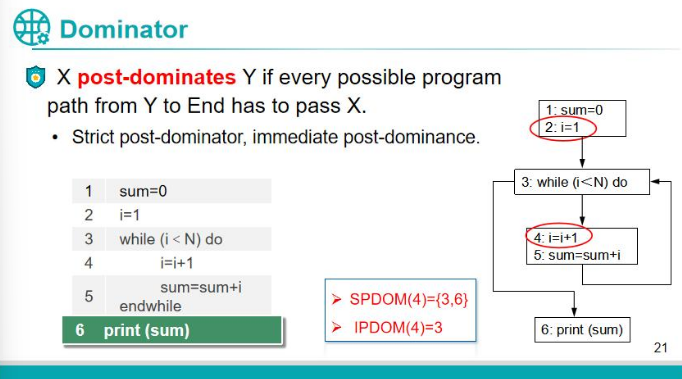

## Logistics
* Due: Tuesday, October 28th AoE.
* Submission instructions: make sure that the required document (assignment4.doc) is submitted to Canvas
* Deadline reminder: after the deadline passes, you cannot earn any points for this assignment.

## Outside resources

On this assignment, there are no restrictions on the use of outside resources for help in any way, including use of AI tools like ChatGPT.

## Assignment

* Get the dominator, strict dominator, immediate dominator, post-dominator, strict post-dominator and immediate post-dominator of line 2 and line 5 in the [given slide](../imgs/prerequisite.png).

## Grading--30 points
   For each dominator, you get 5 points if your solution is fully correct and 0 otherwise.

## Grading turnaround
Final scores will be run at 6am on the due date and scores will be uploaded to Canvas by the next class meeting.
