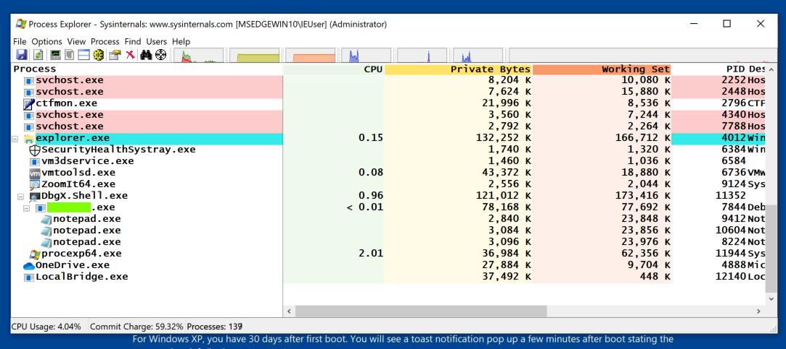
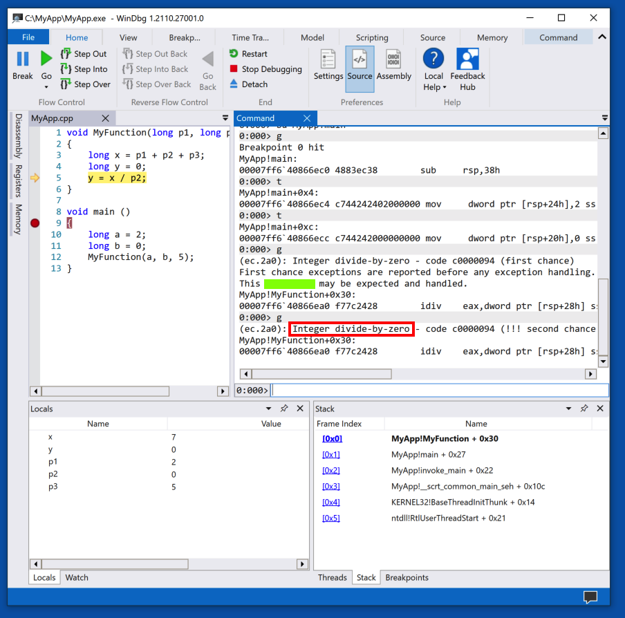
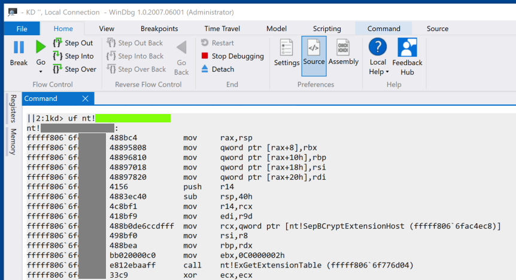

## Logistics
* Due: Tuesday, December 2nd AoE.
* Submission instructions: ensure that you have the source code you want us to
	grade in a file called `project5.doc` in your submission
	directory. You must clearly document what you have done and what you have observed, including relevant screenshots, command snippets, and code snippets. For any significant command or code snippet, a supporting explanation is required to clarify its purpose and functionality. Submissions that include commands or code without explanations will not receive credit. If you encounter any interesting or unexpected observations, you must provide an explanation. Additionally, you are encouraged to explore beyond the lab requirements and conduct further investigation where appropriate.

## Learning outcomes

The objective of this project is to help students become familiar with using WinDbg for kernel-level debugging. The kernel, which serves as the core of the operating system, is contained in the file ntoskrnl.exe. To trace system library calls back to their corresponding kernel functions—instead of simply observing their effects—we must use kernel debugging tools. Among these tools, WinDbg, provided by Microsoft, is the most powerful and widely used. Ultimately, all system API calls are routed to the kernel, as illustrated in the figure below, adapted from the book Practical Malware Analysis.

## Resources
* Code examples relevant to this project can be found in the class slides
* A related video lecture for malware Analysis, recorded by [OALabs](https://www.youtube.com/watch?v=QuFJpH3My7A).
* More information about kernel debugging with [breakpoints](https://dennisbabkin.com/blog/?t=setup-windbg-preview-for-kernel-debugging-via-fast-network-in-vmware-vm#breakpoint_bsod).
* [Checklist](https://blog.lamarranet.com/wp-content/uploads/2021/09/WinDbg-Cheat-Sheet.pdf) for WinDbg Commands

## Assignment
### Task1: Parent Process 
"Launch Process Explorer with Administrator privileges. Scroll to the bottom of the process list and locate the Notepad process (note that there may be multiple instances, as shown in the image below). The flag is the name of the parent process, which is highlighted with a green box in the image.

### Task 2: Crash Message 
The flag is covered by a green box in the image below.

### Task 3: WarBird
Locate the function highlighted in the image below.

The flag is covered by a green box in the image below.

### Task 4:Magic 
Find the word Magic in nt.

The flag is covered by a green box in the image below.

### Task 5: Module 
Find this code. The flag is covered by a green box in the image below.

## Grading--100 point
* 10: task 1 solution is correct
* 10: task 1 has important command snippets or code snippets and supporting descriptions
* 10: task 2 solution is correct
* 10: task 2 has important command snippets or code snippets and supporting descriptions
* 10: task 3 solution is correct
* 10: task 3 has important command snippets or code snippets and supporting descriptions
* 10: task 4 solution is correct
* 10: task 4 has important command snippets or code snippets and supporting descriptions
* 10: task 5 solution is correct
* 10: task 5 has important command snippets or code snippets and supporting descriptions

## Grading turnaround
Scores will be uploaded to Canvas by next class time the Tuesday after the due date.
